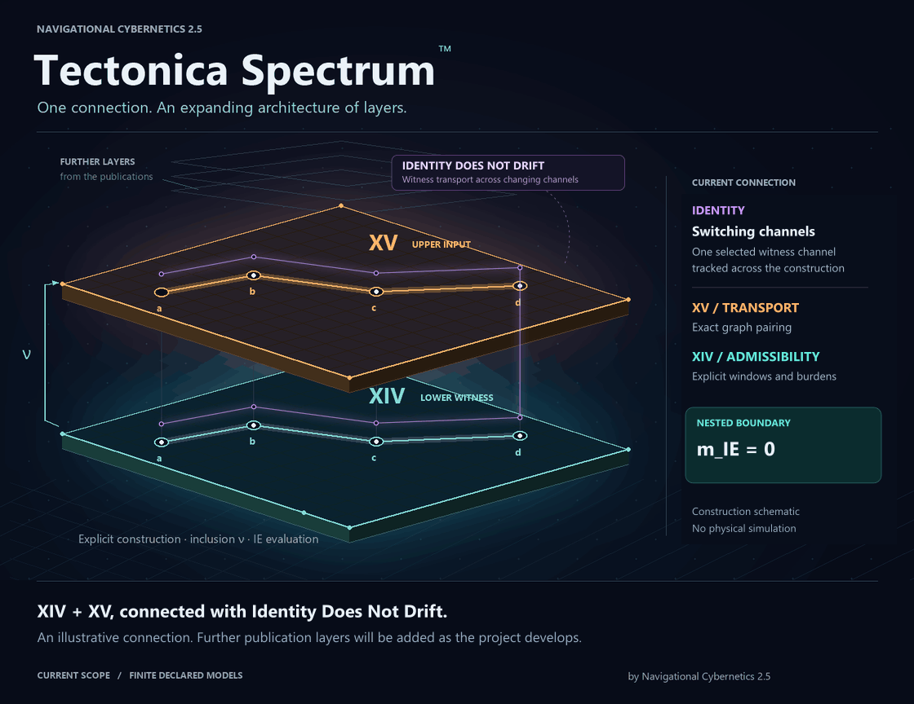

<h1 align="center">Tectonica Spectrum™</h1>
<p align="center">
  <strong>by Navigational Cybernetics 2.5</strong><br>
  Explicit connections. Ordered witnesses. Finite models.
</p>

<p align="center">
  
</p>

<p align="center">
  <a href="#scope-and-limits">Scope</a> ·
  <a href="#layers">Layers</a> ·
  <a href="#run">Run</a> ·
  <a href="INTEGRATION.md">Read the connection</a> ·
  <a href="#sources-and-license">Sources</a> ·
  <a href="assets/layers.png">Static diagram</a>
</p>

Tectonica Spectrum connects independently evolving NC2.5 work through explicit,
executable constructions. Follow a supplied trajectory through nested
substrates, transport a selected witness across changing channels, inspect what
an observation can determine, recompose an accounting route and examine its
ordered prefix budgets. Compare individual viability with common-control
compatibility, and inspect verification relative to declared criteria.

| Follow the connection | What is computed |
|---|---|
| **XV → XIV** | A finite nesting construction, admissibility and an IE boundary witness. |
| **Identity** | Exact transport of a selected witness across a channel-switch history. |
| **Physics of Abstraction** | Whether a declared observation determines the chosen target on its attained fibres. |
| **Finite recomposition** | Cut, fold and typed replacement on a declared accounting route, retaining its ordered windows. |
| **Severance** | Capacity hiding and directed-edge deletion, with separate functional and observational outputs. |
| **Individual Viability Does Not Compose** | Local candidate: three fixed controlled fixtures and a finite observation catalogue. |
| **The Double Fibre of Verification** | Declared PoA27 worlds, criterion-relative targets and visible-fibre decisions. |
| **Person** | Exact ordered prefix budgets, final and whole survival, and the first crossing. |

The animation is a construction schematic. Identity's violet **η** travels
across the two substrate planes; PoA receives a separate observation channel.
The lower panels show Common-Control Compatibility on three fixed fixtures,
Double Fibre on declared PoA27 worlds, and finite recomposition and Severance.
Person follows the retained ordered windows. *Nothing Is Solid, Part VIII* is the conceptual
companion to Severance in their [shared publication](https://doi.org/10.17605/OSF.IO/5VJMR).
It contributes no additional executable layer here.

## Scope and limits

All results concern supplied models and declared finite catalogues. The original
XIV/XV input is an admissible, subcritical finite trajectory with at least one
transition. Its constructed IE witness lies on the nested boundary, `m_IE = 0`.
Positive-margin robustness, physical hostability, epistemic independence and
full Regime W are outside this connection.

Identity tracks a selected witness from a finite certificate. Transported
pairing, the global cohomology class and period constancy remain separate
outputs. PoA's observation decisions concern its declared 27-history catalogue
and selected projections.

Cut, fold and typed replacement retain the specified accounting trace and its
ordered windows. Severance's capacity hiding and directed-edge deletion have
separate functional, observational and reconstruction outputs. These examples
establish no general composition or whole-system identity transfer.

Person interprets complete selected routes at **fixed capacity** with exact
**nonnegative rational costs**. Prefix budgets are nonincreasing, so **final and
whole survival coincide in this class**. Order can change the first crossing;
it does not change that final survival verdict. Positive integer spans locate
declared window ends and establish no physical duration. Moral status and
whole-system identity are outside this finite budget connection.

The *Individual Viability Does Not Compose* candidate evaluates exactly three
controlled source fixtures.
The canonical obstruction covers every admissible measurable control on continuous
t>=0; the two positive cases have stationary witnesses. Its finite observation
catalogue is separate from the graph schedule and its integer coordinates.
The MIT source companion is included in this repository and captured by its
root commit; this local candidate is prepared for release verification.

Double Fibre uses the fixed PoA27 model with its existing projections. Its
singleton baseline and separately declared two-criterion comparison concern
known binary readouts; neither identifies an unknown physical policy. The
refinement (V,Q) is informational and supplies no physical enforcement,
viability or whole-system identity guarantee.

<details>
<summary><strong>Read the exact conditions of each connection</strong></summary>

The XIV/XV construction takes a supplied finite, admissible, subcritical upper
trajectory with at least one transition. It constructs a lower substrate with
unit edge burdens, capacity equal to the traversal count, and explicit window
admissibility. XIV evaluates the resulting witness: `NESTED-BOUNDARY`, with
`m_IE = 0`. Finite positive capacity and no parallel directed edges are required;
self-loops and repeated traversals are allowed.

This establishes a formal IE witness, without positive-margin robustness,
physical hostability or epistemic independence. Transported pairing annihilation,
global class zero and full Regime W are distinct results. The full Regime W
conditions are not evaluated. The XV Bridge Law remains declared; physical
experiments and a general proof of XIV.2 are outside this executable connection.

Identity adds a certificate-defined two-loop carrier and exact schedule traces.
Its window costs are explicitly assigned to a separate directed accounting path,
then compared against XIV burdens at every prefix. The global cohomology class,
transported pairing, period constancy and IE verdict remain separate outputs.

Physics of Abstraction adds an observation audit over all 27 three-switch words
in the certificate's A/B/C alphabet. Its target is preservation of the full fixed
covector at every switch, distinguished from preservation by the composite map.
A final-cycle-and-cost view and a period-trace-and-cost view each hide conflicting
target values. Adding the per-switch membership bits determines this target by
construction; that factorisation is not an independent validation of the bits.

These conclusions concern the declared finite catalogue and projections.
The full output contains more information than those reduced views. No physical
identity criterion or isolation boundary between an acting process and an
observer is established. Read [the connection](INTEGRATION.md) for
the types, counterexamples and exact observation definitions.

The finite boundary adapter adds cut, fold and replacement operations on a
declared accounting chain. It retains ordered auxiliary window data and checks
a specified endpoint, horizon and budget. These operations do not establish
physical duration, whole-system identity or arbitrary system composition.

The finite Severance adapter models capacity-field hiding and directed-edge
deletion, with separate functional, entropy and fixed-catalogue reconstruction
outputs. These concern supplied path costs and marked endpoints, not physical
deletion or preservation of a whole system.

The Person connection uses the pinned `person_harness.py` on complete selected
recomposition routes. It preserves every ordered window's exact nonnegative
rational cost and positive integer span, evaluates prefix budgets at the graph's
fixed capacity and reports final survival, whole-trajectory survival and the
first crossing as a window index and cumulative span. These declared integer
coordinates do not establish physical duration. In this fixed-capacity,
nonnegative-cost class, final and whole survival are equivalent; order can alter
the first crossing without changing that verdict. The connection does not
establish moral status or whole-system identity.

</details>

## Layers

| Layer | Responsibility |
|---|---|
| [ONTOΣ XIV](https://github.com/petronushowcore-mx/NC2.5-ONTOSigma-XIV-Cross-Layer-Forgetful-Separation-corpus) | Finite substrates, admissibility, IE and robustness. |
| [ONTOΣ XV](https://github.com/petronushowcore-mx/NC2.5-ONTOSigma-XV-Spin-Channel-and-Nestability-corpus) | Nestability, graph cohomology and transport. |
| [Identity Does Not Drift](https://github.com/petronushowcore-mx/Identity-Does-Not-Drift) | Channel schedules, exact witness transport and an independently replayed finite certificate. |
| [The Physics of Abstraction](https://github.com/petronushowcore-mx/physics-of-abstraction) | Factorisation through observations and three-valued decisions on attained observation fibres. |
| [Severance Defect and the Binding Functional](https://doi.org/10.17605/OSF.IO/5VJMR) | Finite capacity hiding and directed-edge deletion through the local Severance adapter. |
| [The Person Is Not a Sum](https://github.com/petronushowcore-mx/NC25-Person-Is-Not-a-Sum) | Exact finite budgets and first crossing on selected ordered window traces. |
| [Individual Viability Does Not Compose](https://doi.org/10.17605/OSF.IO/WFBX6) | MIT companion included in this repository: three fixed controlled fixtures and a finite observation catalogue, pinned by the root commit. |
| [The Double Fibre of Verification](https://github.com/petronushowcore-mx/The-Double-Fibre-of-Verification) | Declared history and criterion worlds, factorisation through retained-D observations and informational refinement. |
| [Ledger (NC25OL)](https://github.com/petronushowcore-mx/NC25OL) — external module | Associates finite XIV/XV observations with a declared registry record and demonstrates permit-gated local release of their source bundle. |
| TECTONICA | Selects exact dependency commits, checks the schedule-to-substrate correspondence, audits declared observations of finite switch histories and builds finite recomposition and Severance examples on the pinned accounting carrier, interprets selected ordered routes through Person’s finite budget API, compares three controlled fixtures through PoA observation fibres, and evaluates Double Fibre on declared history-and-criterion worlds. |

Ledger connects through its [Spectrum observation](https://github.com/petronushowcore-mx/NC25OL/tree/main/examples/spectrum_observation) and [source-release](https://github.com/petronushowcore-mx/NC25OL/tree/main/examples/spectrum_release) examples. These external examples cover the finite XIV/XV composition and keep observation results separate from release authority.

This local candidate connects eight source works. Six `layers/` entries are
Git submodules, while `layers/ProbeVI` is an ordinary tracked MIT source tree
pinned by the TECTONICA root commit. Severance uses a local adapter.
The six committed gitlinks fix the external dependency versions; `.gitmodules`
gives their source URLs. Dependencies are not selected from
moving branch tips at launch. The original IE adapter remains in XV. This
repository's `identity_stitch.py` implements the schedule composition;
`poa_stitch.py` adds the finite observation audit.
`recomposition_stitch.py` builds the finite boundary examples from XIV,
XV, Identity and PoA; it is a local composition adapter, with no separate dependency.
`severance_stitch.py` models finite field and directed-edge excision on the
same accounting carrier; it is another local adapter, with no new dependency.
`person_stitch.py` connects these ordered routes to the pinned Person API through
`person_adapter.py`, which projects the existing windows without inventing new
spans. The local adapters import the pinned layer code. After initialising the
submodules, read `layers/XV/INTEGRATION.md` for the construction and its
premises, and `layers/XIV/ERRATA.md` and
`layers/XV/ERRATA.md` for the corrections at those recorded versions.
The deposited scientific source files and earlier repository history are preserved.

This candidate has seven source bindings under `layers/`: six external
repositories and the included Probe VI tree. It connects eight source works,
including Severance through its local adapter. Double Fibre has its own
recorded public pin. These changes form a local release candidate.
Nothing Is Solid is its conceptual companion; the essay has no separate executable connection.
Seven local adapters, `identity_stitch.py`, `poa_stitch.py`,
`recomposition_stitch.py`, `severance_stitch.py`, `person_stitch.py`,
`common_control_stitch.py` and `double_fibre_stitch.py`, follow
`pinned_sources.py` as eight launcher children.

## Individual Viability Does Not Compose

**Local candidate: MIT companion included in `layers/ProbeVI`, pinned by the TECTONICA root commit.**

*Individual Viability Does Not Compose* supplies three fixed controlled fixtures: the
canonical actuator at x_star, that actuator at x3=0, and the aligned actuator
at x_star. Unsupported data yields NOT_ESTABLISHED before Boolean decisions.
The target asks whether one admissible measurable control satisfies both
constraints for every continuous t>=0. The work's canonical proof establishes
obstruction for all such controls; the two stationary controls supply explicit
positive witnesses. The strategy label describes the supplied local and
positive certificates, not a restriction of the negative theorem to constant
controls. This horizon is unrelated to the accounting graph's coordinates,
Person's spans or burdens, whole identity or moral status.

Each fixture is indexed by a distinct singleton typed PoA History, with a
bijection back to the controlled object. This is an index encoding only:
its loop, zero defect and admitted flag have no physical or control meaning.
The observation and target are computed from the decoded controlled object,
never from that synthetic admitted flag.

TECTONICA adds a finite catalogue using PoA's generic fibre_decision and
factors_through. The target has values false, true, true. The local_viability
observation records both exact local Boolean readouts. Each readout is computed
from its constraint's polynomial trajectory coefficients, zero remainder and
control bounds; for the canonical plant each constraint uses its own supplied
control. For the stationary cases both use the same constant control. All
three fixtures have (true,true), whose attained fibre therefore mixes
compatible and incompatible cases and yields insufficient observation.

The full_profile observation retains exact A, B, H, h, x0, control bounds,
horizon, declared certificate strategy and supplied controls. It distinguishes
all three catalogue entries and yields reject, admit, admit. This is
informational sufficiency by construction, not independent scientific
evidence or a general theorem about arbitrary plants. The finite catalogue
and these projections are TECTONICA's construction, not a claim imported from
*Individual Viability Does Not Compose*. No accounting-graph-to-controlled-plant mapping is introduced.

This candidate includes the MIT companion at `layers/ProbeVI/harness/probe_vi.py`.
Its source is an ordinary tracked tree pinned by the TECTONICA root commit,
with six other dependencies pinned by external gitlinks.
`common_control_stitch.py` is the seventh sequential launcher child. A proved
canonical obstruction is a successful scientific result and returns zero
alongside the two positive witnesses. Source refusal or an unestablished
catalogue entry stops the child.

## Run

Python 3.10 or newer and Git with support for `--no-lazy-fetch` are required. Git versions
that do not recognise this option are refused. Python dependencies are
standard-library only.
Clone this repository and initialise its recorded dependencies:

```text
git clone https://github.com/petronushowcore-mx/TECTONICA.git
cd TECTONICA
git submodule update --init --recursive
python -B tectonica.py --check-only
python -B tectonica.py
python -B -O tectonica.py
```

The launcher requires each external dependency to have the recorded commit
and a clean working tree. Probe VI must be a tracked tree in the root commit;
its Git root must be TECTONICA, and its own directory must be clean. Both checks
include untracked and ignored files and refuse index flags that hide working
files. Root changes outside `layers/ProbeVI` are outside that source check. Use dedicated clean checkouts; keep results outside `layers/`.
Once the dependencies are present, the launcher does not fetch or update them.
Missing promised objects are refused without retrieval.
Run only trusted checkouts: their Python code is executed.

<details>
<summary><strong>Reports, source loading and verification commands</strong></summary>

A successful candidate launch prints all seven selected commits and runs eight children in
order: `pinned_sources.py` runs XV's construction and controls, followed by
`identity_stitch.py`, `poa_stitch.py`, `recomposition_stitch.py`,
`severance_stitch.py --teeth`, `person_stitch.py`, `common_control_stitch.py` and `double_fibre_stitch.py`. The fourth child executes
16 checks before reporting cut, fold and replacement results; the fifth runs
eleven finite Severance checks; the sixth runs eight Person connection checks
and reports each selected route's budgets and survival results. These children
refuse when the number of checks actually executed differs from the declared
count. A correct negative survival result is a successful computation. The
first failed child stops the sequence and its exit status is returned.
Dependency checks fail with status 2 before any child starts.

The results include source hashes, the four original schedule traces,
prefix-by-prefix cost correspondence, separate transport diagnostics and a
boundary IE witness for each schedule. The PoA child adds all 27 three-switch
histories and three observation audits, each reporting its fibres and whether
the target factors through that observation. Successful execution does not mean
every history is admitted: a mixed fibre is reported as `insufficient observation`.

Before executing a dependency module or parsing the Identity certificate,
`pinned_sources.py` compares the bytes read with the blob at the selected commit.
It executes or parses that same buffer. Exact bytes and whole LF-to-CRLF
conversion of LF text are accepted; other content changes are refused. Reported
hashes identify the consumed bytes, including their line endings. The loader
reuses only its own recorded modules and refuses foreign cached modules.

The root package, Python, Git and their runtime environment must be trusted.
Git commands ignore inherited `GIT_*` overrides and replacement objects. This
binds consumed dependency content to the selected commits; it does not isolate
the process from an actor who can alter the trusted runtime. The Python version
and accepted checkout line endings remain separate reproducibility inputs.

Local launch-contract tests use explicit Git-response fixtures and require no
initialised submodules:

```text
python -B -m unittest -v test_tectonica
python -B -O -m unittest -v test_tectonica
```

Integration tests require six initialised, clean submodules and the tracked,
clean `layers/ProbeVI` tree:

```text
python -B -m unittest -v test_tectonica test_pinned_sources test_identity_stitch test_poa_stitch test_recomposition_stitch test_person_stitch test_common_control_stitch test_double_fibre_stitch
python -B -O -m unittest -v test_tectonica test_pinned_sources test_identity_stitch test_poa_stitch test_recomposition_stitch test_person_stitch test_common_control_stitch test_double_fibre_stitch
```

The copied recomposition mutations run with:

```text
python -B break_recomposition_stitch.py
```

This tests 34 declared model changes and controls in normal Python and `-O`.
Negative changes must produce their expected first named failure; the positive
control must survive, the reach control must reach the changed line, and
deleting one named check must be refused. Only temporary copies are changed.
The runner directory must be writable; the checks concern these finite
declared examples. The unit tests in `test_recomposition_stitch.py` check the
adapter's source contracts on substituted carriers; the pinned carrier itself
is read by the launcher's fourth child.

`--check-only` verifies dependency pins, cleanliness and required entry files;
it does not execute certificate replay or mathematical checks.

The standalone Severance report and checks use:

```text
python -B severance_stitch.py
python -B severance_stitch.py --teeth
python -B break_severance_stitch.py
```

The last command tests 14 declared model changes and controls in normal Python
and `-O`, on temporary copies only. Its fixed comparison classes and source
conditions are declared in
[the connection](INTEGRATION.md#finite-severance-catalogue).

The Person report and its copied adapter mutations can also be run directly:

```text
python -B person_stitch.py
python -B person_stitch.py --teeth
python -B break_person_stitch.py
python -B -O break_person_stitch.py
```

The mutation runner checks twelve changes against the eight named connection
checks and requires the expected check to fail first. It changes adapter
buffers in memory; pinned source files remain unchanged. The Person unit tests
exercise real pinned bytes, one verified source read, source substitutions,
module conflicts and refusal status. The report retains complete prefix
budgets separately from final and whole survival.

</details>

## Versioning and additional layers

Further layers from published NC2.5 works are planned. Each addition requires an
implemented connection and its compatibility checks before it joins a release.

Each release records one composition of independently versioned layers. Develop
changes to an external layer in its own repository, then update its gitlink
here alongside the connection checks. The included Probe VI companion changes
through the TECTONICA root commit and retains its own MIT licence. A new layer brings its own declared inputs,
outputs and conditions of compatibility before joining the composition.

Publish a new release for a changed composition. Keep earlier release tags and
their recorded layer commits unchanged so that previous compositions can still
be checked out and reproduced.

Release numbers have the form `vMAJOR.LAYERS.REVISION`, two digits each. The
middle number counts the published works whose connection the release launcher
executes. The released `v00.06.01` connects six works; this candidate adds
Individual Viability Does Not Compose and The Double Fibre of Verification,
bringing the connection to eight works. Source bindings and launcher children
are counted separately above. The last number grows with
every release while that count stays the same, including releases that move a
pinned commit, and starts again at `01` when the count changes. The first
release, `v0.1.0`, predates this numbering.

## Sources and license

ONTOΣ XIV: [10.17605/OSF.IO/KAGMH](https://doi.org/10.17605/OSF.IO/KAGMH).
ONTOΣ XV: [10.17605/OSF.IO/EAUD5](https://doi.org/10.17605/OSF.IO/EAUD5).
Identity Does Not Drift: [10.17605/OSF.IO/4NMTW](https://doi.org/10.17605/OSF.IO/4NMTW).
The Physics of Abstraction: [10.17605/OSF.IO/QJ5BR](https://doi.org/10.17605/OSF.IO/QJ5BR).
Severance Defect and the Binding Functional: [10.17605/OSF.IO/5VJMR](https://doi.org/10.17605/OSF.IO/5VJMR).
The Person Is Not a Sum: [10.17605/OSF.IO/MJPDX](https://doi.org/10.17605/OSF.IO/MJPDX).
Individual Viability Does Not Compose: [10.17605/OSF.IO/WFBX6](https://doi.org/10.17605/OSF.IO/WFBX6)
(NC2.5 Empirical Probes — Part VI). Its MIT companion is included at
[`layers/ProbeVI`](layers/ProbeVI/README.md), with its own
[MIT licence](layers/ProbeVI/LICENSE), and is pinned by the root commit.
The Double Fibre of Verification: [10.17605/OSF.IO/Z9E5N](https://doi.org/10.17605/OSF.IO/Z9E5N).
*Nothing Is Solid, Part VIII* shares the Severance DOI as its conceptual
publication companion. It has no separate executable dependency here.
These identify the source works, not a separate DOI for TECTONICA.
Changes between releases are listed in [CHANGELOG.md](CHANGELOG.md).

Copyright (c) 2026 Maksim Barziankou (MxBv), The Urgrund Laboratheory.
[CC BY-NC-ND 4.0](LICENSE). Contact: research@petronus.eu.

## Double Fibre candidate

The immutable DoubleFibre source is available at `fed7eed1736d29733bdee0b4b000eed2e87d37cd`, with entry `layers/DoubleFibre/harness/double_fibre_audit.py`. The candidate adds `double_fibre_stitch.py` as its eighth sequential child, after common control. Probe VI is included as the ordinary MIT tree `layers/ProbeVI`, pinned by the root commit. These files form a local release candidate. See INTEGRATION.md for the declared model and limits.

The standalone connection checks and in-memory model changes require the same
installed, pinned dependencies as the adapter:

```text
python -B test_double_fibre_stitch.py
python -B -O test_double_fibre_stitch.py
python -B break_double_fibre_stitch.py
python -B -O break_double_fibre_stitch.py
```

The test module runs eight named checks; its two unittest cases check their
executed count and results. The mutation runner checks eleven changes and
controls, requires all eight checks to remain present and the expected first
failure, and writes no files. These commands do not establish physical identity.
